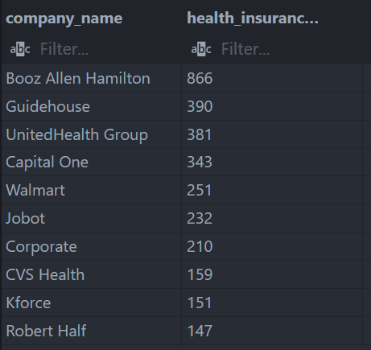
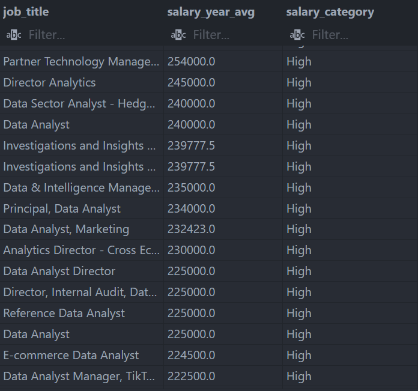
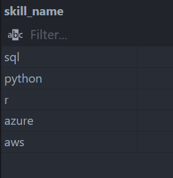

# 📊 Data Job Analysis Using SQL (Learning Project)

[](https://www.postgresql.org/)
[](https://opensource.org/licenses/MIT)

**Status:** Ongoing (SQL learning project)

## 📌 Overview
This repository contains my ongoing SQL learning and practice using PostgreSQL.
The project focuses on analyzing job and salary data to strengthen my skills in
data querying, transformation, and basic analysis.

## 🗄️ Dataset
- Source: Public job dataset (CSV format)
- Usage: Educational and portfolio purposes
- Tables:
    1. **job_postings_fact**  
        Main fact table containing job posting details such as job title, location, salary, schedule type, and posting date.
    2. **company_dim**  
        Dimension table containing company information related to each job posting.
    3. **skills_dim**  
        Dimension table listing unique skills and their categories.
    4. **skills_job_dim**  
        Bridge table to represent the many-to-many relationship between job postings and required skills.

## 🛠️ Key SQL Skills Demonstrated
    - Creating relational tables and importing CSV data into PostgreSQL
    - Date-time manipulation and feature extraction (month, year)
    - Using CASE statements for data categorization
    - Applying subqueries and Common Table Expressions (CTEs) to extract insights

## 🔍 Sample of Cases
1. [Case 1](./advanced_sql/practice_advanced_sql/1_dates_practice.sql)
    
    Find companies that posted health-insured job openings during Q2 2023 using date extraction and aggregation.

    ```sql
        SELECT
            cd.name as company_name,
            COUNT(jpf.job_id) AS health_insurance_jobs
        FROM
            job_postings_fact as jpf
        JOIN
            company_dim as cd
            ON jpf.company_id = cd.company_id
        WHERE
            jpf.job_health_insurance = TRUE
            AND EXTRACT(YEAR FROM jpf.job_posted_date) = 2023
            AND EXTRACT(QUARTER FROM jpf.job_posted_date) = 2
        GROUP BY
            company_name
        ORDER BY
        health_insurance_jobs DESC
        LIMIT 10;
    ```

     


2. [Case 2](./advanced_sql/practice_advanced_sql/2_cases_practice.sql) 
    
    Categorize Data Analyst salaries into low, medium, and high ranges to identify high-value job postings.

    ```sql
        SELECT
            job_title,
            salary_year_avg,
            CASE
                WHEN salary_year_avg < 50000 THEN 'Low'
                WHEN salary_year_avg BETWEEN 50000 AND 100000 THEN 'Medium'
                ELSE 'High'
            END AS salary_category
        FROM
            job_postings_fact
        WHERE
            job_title_short = 'Data Analyst' AND
            salary_year_avg IS NOT NULL
        ORDER BY
            salary_year_avg DESC;
    ```
     


3. [Case 3](./advanced_sql/practice_advanced_sql/3_subqueries_practice.sql) 
    
    Identify the top 5 most in-demand skills based on job postings. Use a subquery to count skill frequency and join with skills metadata

    ```sql
        SELECT
            sd.skills AS skill_name
        FROM
            skills_dim AS sd
        JOIN (
            SELECT
                skill_id
            FROM
                skills_job_dim
            GROUP BY
                skill_id
            ORDER BY
                COUNT(job_id) DESC
            LIMIT 5
        ) AS top_skills
            ON sd.skill_id = top_skills.skill_id;
    ```
     


## Project Structure
```text
.
├── 📁 advance_sql/                 # Advance courses and practices
│   └── 📁 practice_advance_sql/ 
├── 📁 assets/                      # Query documentations
├── 📁 sql_load/                    # DDL & DML 
├── 📄 .gitignore        
└── 📄 README.md                    # Project documentation
```

## ⚠️ Disclaimer
This project is part of my SQL learning process and is intended for educational and portfolio purposes only.

This repository reflects my learning progression in SQL and is *continuously updated* as I explore more advanced analytical techniques.